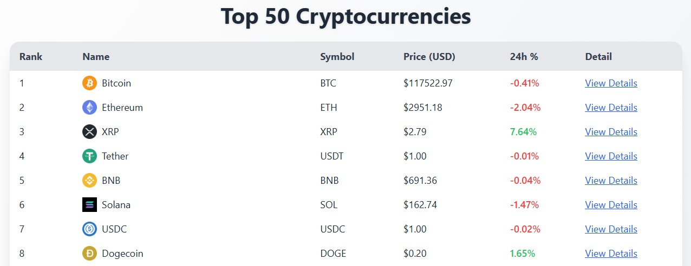
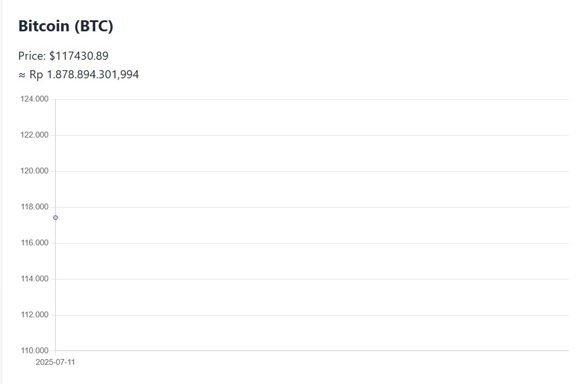

# 🪙 Crypto Dashboard

Crypto Dashboard adalah aplikasi web yang menampilkan daftar 50 cryptocurrency teratas secara **real-time** menggunakan data dari [Coinpaprika API](https://api.coinpaprika.com/).

## 🚀 Fitur Utama

- Daftar 50 koin kripto teratas beserta simbol, harga, dan persentase perubahan 24 jam.
- Tampilan detail harga dan grafik historis (7 hari terakhir) untuk masing-masing koin.
- Desain modern dengan tema gradient, UI ringan berbasis **React** & **TailwindCSS**.
- Backend **Flask API** sebagai jembatan ke data dari Coinpaprika.

---

## 🛠️ Teknologi yang Digunakan

- **Frontend**: React, Vite, Tailwind CSS, Chart.js, React Router
- **Backend**: Flask (Python), Coinpaprika API
- **Lainnya**: GitHub Pages (untuk frontend), Render.com atau Railway.app (untuk backend jika perlu)

---

## 📷 Tampilan Aplikasi

### 🏠 Halaman Utama


### 📈 Halaman Detail Koin

- Data yang di fetch hanya data realtime (bisa diubah untuk menampilkan history fluktuasi)

---

## 📦 Instalasi Lokal

### 1. Clone Repo
```bash
git clone https://github.com/username/crypto-dashboard.git
cd crypto-dashboard
